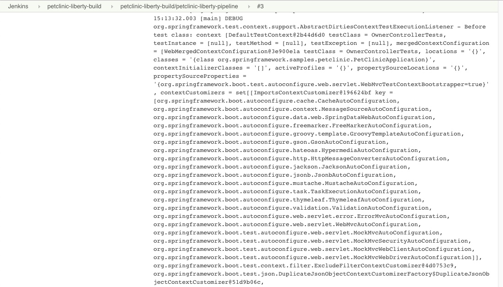
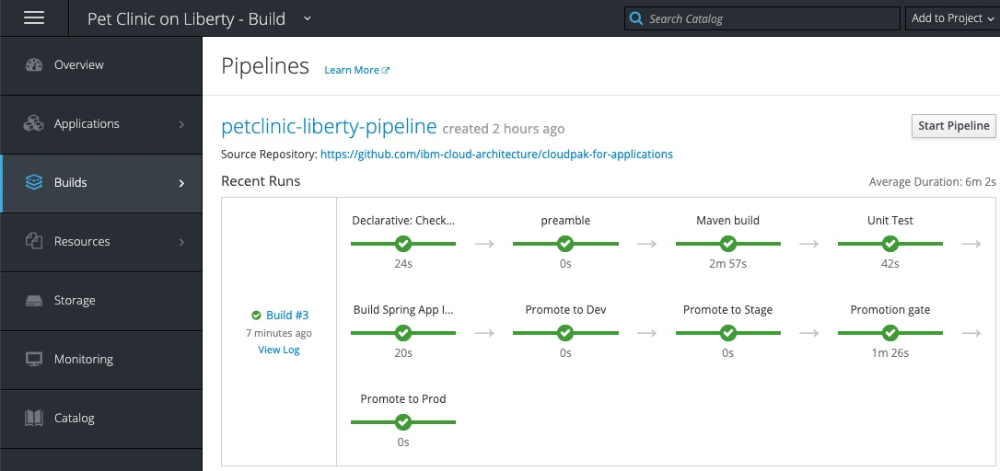
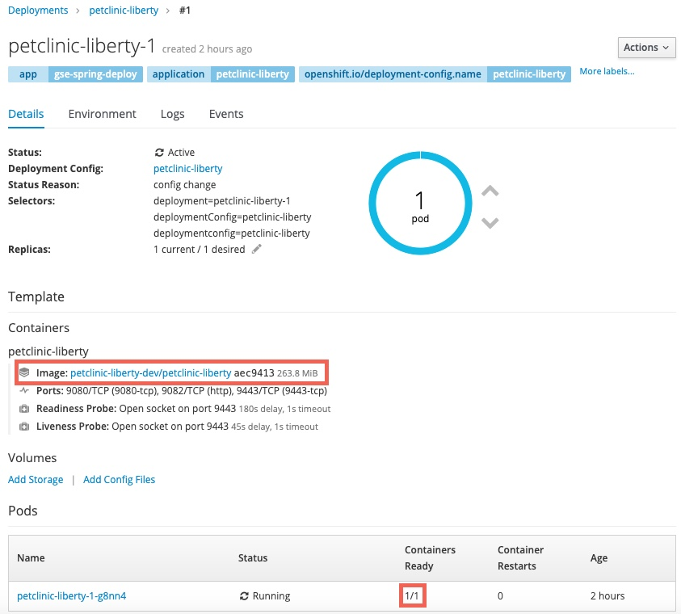
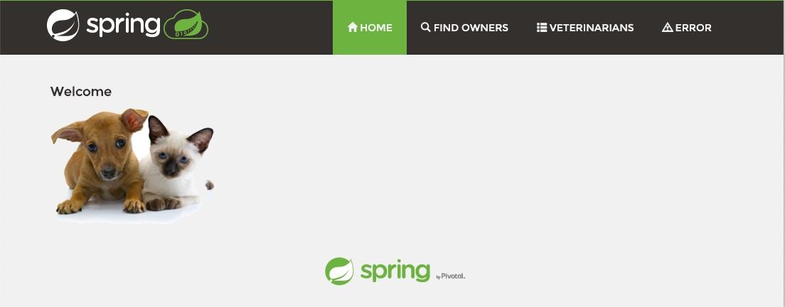

# Spring Modernization

**Spring modernization** describes the process of upgrading existing Spring Framework and Spring Boot v1 applications to use [Spring Boot v2](https://spring.io/projects/spring-boot). Pivotal have made some changes to the [list of supported versions of Spring](https://github.com/spring-projects/spring-framework/wiki/Spring-Framework-Versions) that may require modernization of existing applications to Spring Boot v2.

With the [Open Liberty](https://openliberty.io/) project, IBM have [provided support for Spring Boot](https://www.ibm.com/cloud/blog/open-liberty-loves-spring) and made [optimizations to the runtime and Docker images specifically for Spring Boot](https://openliberty.io/blog/2018/07/02/creating-dual-layer-docker-images-for-spring-boot-apps.html).

There are some benefits of running Spring Boot applications on the Open Liberty runtime:

- Performance. Benchmarks have shows that Liberty perform better than Tomcat on both throughput and response time.

- Size.  The memory footprint of Liberty is smaller than tomcat, but more importantly the Spring Boot libraries can be separated from the runtime libraries. When we look at the way Docker builds it's images using layers, the application portion is much smaller if we build out images in the optimized way.  This means faster build time, and if you're storing every version of your application you build, the delta between versions is much smaller

- Support. If you're running on OpenShift using IBM Cloud Paks, using the Liberty runtime is included in your licensing model, so using Liberty comes at no additional cost, but if need any support for Liberty it's included.  If you stick with standard Spring Boot with tomcat, you'll have to either run on an unsupported platform, or pay for additional support for the tomcat runtime.

-  Consistent runtime model.  Running Liberty has many best practices especially in the Kubernetes/OpenShift world.  There are built in metrics and monitoring tools which are specifically designed to be integrated into OpenShift.  Using Liberty allows you to leverage many if these automatic connections to better maintain your environment.

This repository holds a solution that is the result of a modernization for an Spring application that was upgraded to Spring Boot on Open Liberty and deployed by the IBM CloudPak for Applications to RedHat OpenShift.

## Table of Contents

- [Application Overview](#application-overview)
- [How the Application was Modernized](#how-the-application-was-modernized)
  - [Code Changes](#code-changes)
  - [Build](#build)
  - [Deploy](#deploy)
- [Deploy the Application](#deploy-the-application)
  - [Getting the project repository](#getting-the-project-repository)
  - [Create the Security Context Constraint](#create-the-security-context-constraint)
  - [Create the projects](#create-the-projects)
  - [Create a service account](#create-a-service-account)
  - [Deploy Jenkins](#deploy-jenkins)
  - [Update the Jenkins service account](update-the-jenkins-service-account)
  - [Import the deployment templates](#import-the-deployment-templates)
  - [Create the deployment definitions](#create-the-deployment-definitions)
  - [Import the build templates](#import-the-build-templates)
  - [Create the build definitions](#create-the-build-definitions)
  - [Run the pipeline](#run-the-pipeline)
- [Validate the Application](#validate-the-application)
- [Summary](#summary)

## Application Overview
Pet Clinic is a demonstration application that was created in 2003 to show the features and functions of the Spring Framework. A description of the original application can be found in the **The Pet Clinic Application** section of the [readme](https://projects.spring.io/spring-petclinic/#quick-start)

## How the Application was Modernized
In order to modernize the application from the Spring Framework to Spring Boot and Open Liberty running on OpenShift, the application went through **code changes**, **build** and **deploy** phases.

### Code Changes
Pet Clinic was modernized by the open source community in 2013 from Spring Framework 2.5 to Spring Framework 3.0 and then in 2016 to Spring Boot. The process of making the code changes is outside of the scope of this document, however the general modernization process is described below:

- [Spring Framework Upgrades](https://github.com/spring-projects/spring-framework/wiki/Upgrading-to-Spring-Framework-5.x)
- [Spring Boot Upgrades](https://github.com/spring-projects/spring-boot/wiki/Spring-Boot-2.0-Migration-Guide)
- [Spring Framework to Spring Boot](https://www.baeldung.com/spring-boot-migration)

### Build
The **build** phase created the Dockerfile for the application.

A Spring Boot application JAR or WAR file is a self-contained artifact. It packages all of the application dependencies inside the final artifact alongside the application content, including an embedded server implementation, such as Tomcat, Jetty, or Undertow. The result is a fat artifact that is easy to run on any server that has a JVM. It also results in a large artifact, even for the smallest hello world Spring Boot web application.

The Pet Clinic `Dockerfile` for the self-contained jar is shown below:

```
FROM openliberty/open-liberty:springBoot2-ubi-min
COPY --chown=1001:0 spring-petclinic/target/spring-petclinic-2.1.0.BUILD-SNAPSHOT.jar /config/dropins/spring/
```

In order to optimize the Docker image, the [Dual Layer Approach](https://openliberty.io/blog/2018/07/02/creating-dual-layer-docker-images-for-spring-boot-apps.html) that IBM has created is used and resulted in the `Dockerfile` shown below:

```
ARG IMAGE=openliberty/open-liberty:springBoot2-ubi-min
FROM ${IMAGE} as staging

COPY --chown=1001:0 spring-petclinic/target/spring-petclinic-2.1.0.BUILD-SNAPSHOT.jar /staging/fatClinic.jar

RUN springBootUtility thin \
 --sourceAppPath=/staging/fatClinic.jar \
 --targetThinAppPath=/staging/thinClinic.jar \
 --targetLibCachePath=/staging/lib.index.cache

FROM ${IMAGE}
COPY --from=staging /staging/lib.index.cache /lib.index.cache
COPY --from=staging /staging/thinClinic.jar /config/dropins/spring/thinClinic.jar
```

The final file can be found here:

  - [Dockerfile](https://github.com/ibm-cloud-architecture/cloudpak-for-applications/blob/spring/Dockerfile)

2. The containerized application was tested locally before the code and configuration files were committed to the **git** repository

### Deploy
The **deploy** phase created the Jenkins, Kubernetes and Red Hat OpenShift artifacts required to automate the build and deployment pipeline for the application. For illustration purposes, the application was deployed to three different Red Hat OpenShift projects to simulate `development`, `staging` and `production`. The diagram below shows the flow through the pipeline. A more detailed description can be found [here](liberty-deploy.md)

  

The steps were:

1. Configure the Red Hat OpenShift Cluster for WebSphere by creating the necessary `SecurityContextConstraints` definition. The file can be found here:

- [scc.yaml](https://github.com/ibm-cloud-architecture/cloudpak-for-applications/blob/spring/Deployment/OpenShift/ssc.yaml)

2. Create the Red Hat OpenShift **build template** that would be used to define the Red Hat OpenShift artifacts related to the build process including `ImageStream` and `BuildConfig` definitions. The file can be found here:

- [template-libery-build.yaml](https://github.com/ibm-cloud-architecture/cloudpak-for-applications/blob/spring/Deployment/OpenShift/template-liberty-build.yaml)

3. Create the Red Hat OpenShift **deployment template** that would be used to define the Red Hat OpenShift artifacts related to the Pet Clinic application including `DeploymentConfig`, `Service` and `Route` definitions. The file can be found here:

- [template-libery-deploy.yaml](https://github.com/ibm-cloud-architecture/cloudpak-for-applications/blob/spring/Deployment/OpenShift/template-liberty-deploy.yaml)

4. Create the Jenkins `Jenkinsfile` for the pipeline. The Jenkinsfile defines the steps that the pipeline takes to build the Pet Clinic application, create an immutable Docker Image and then move the image through the `dev`, `stage` and `prod` environments. The file can be found here:

- [Jenkinsfile](https://github.com/ibm-cloud-architecture/cloudpak-for-applications/blob/spring/Jenkinsfile)

5. Create the `build` project, load the **build template** and configure **Jenkins**

6. Create the `dev`, `stage` and `prod` projects and load the **deployment template**

7. Verify the pipeline.

Detailed, step-by-step instructions on how to replicate these steps are provided [here](liberty-deploy.md)

## Deploy the Application
The following steps will deploy the modernized Pet Clinic application in a Open Liberty container to a Red Hat OpenShift cluster.

### Prerequisites
You will need the following:

- [Git CLI](https://git-scm.com/book/en/v2/Getting-Started-Installing-Git)
- Red Hat OpenShift 3.11 with Cluster Admin permissions
- [oc CLI](https://docs.openshift.com/container-platform/3.11/cli_reference/get_started_cli.html)
- DB2 Database

### Getting the project repository
You can clone the repository from its main GitHub repository page and checkout the appropriate branch for this version of the application.

```
git clone https://github.com/ibm-cloud-architecture/cloudpak-for-applications.git
cd cloudpak-for-applications
git checkout spring
```

### Create the Security Context Constraint
In order to deploy and run the Open Liberty Docker image in an OpenShift cluster, we first need to configure certain security aspects for the cluster. The `Security Context Constraint` provided [here](https://github.com/ibm-cloud-architecture/cloudpak-for-applications/blob/spring/Deployment/OpenShift/ssc.yaml) grants the [service account](https://kubernetes.io/docs/tasks/configure-pod-container/configure-service-account/) that the Open Liberty Docker container is running under the required privileges to function correctly.

A **cluster administrator** can use the file provided [here](https://github.com/ibm-cloud-architecture/cloudpak-for-applications/blob/spring/Deployment/OpenShift/ssc.yaml) with the following command to create the Security Context Constraint (SCC):

```
cd Deployment/OpenShift
oc apply -f ssc.yaml
```

### Create the projects
Four Red Hat OpenShift projects are required in this scenario:
- Build: this project will contain the Jenkins server and the artifacts used to build the application image  
- Dev: this is the `development` environment for this application
- Stage: this is the `staging` environment for this application
- Prod: this is the `production` environment for this application

The file provided [here](https://github.com/ibm-cloud-architecture/cloudpak-for-applications/blob/spring/Deployment/OpenShift/liberty-projects.yaml) contains the definitions for the four projects in a single file to make creation easier

Issue the command shown below to create the projects
```
oc create -f liberty-projects.yaml
```

### Create a service account
It is a good Kubernetes practice to create a [service account](https://kubernetes.io/docs/tasks/configure-pod-container/configure-service-account/) for your applications. A service account provides an identity for processes that run in a Pod. In this step we will create a new service account with the name `websphere` in each of the `dev`, `stage` and `prod` projects and add the Security Context Constraint created above to them.

Issue the commands shown below to create the `websphere` service account and bind the ibm-websphere-scc to it in each of the projects:
```
oc create serviceaccount websphere -n petclinic-liberty-dev
oc create serviceaccount websphere -n petclinic-liberty-stage
oc create serviceaccount websphere -n petclinic-liberty-prod
oc adm policy add-scc-to-user ibm-websphere-scc -z websphere -n petclinic-liberty-dev
oc adm policy add-scc-to-user ibm-websphere-scc -z websphere -n petclinic-liberty-stage
oc adm policy add-scc-to-user ibm-websphere-scc -z websphere -n petclinic-liberty-prod
```

### Deploy Jenkins
Some Red Hat OpenShift clusters are configured to automatically provision a Jenkins instance in a build project. The steps below can be used if your cluster is not configured for automatic Jenkins provisioning:

```
oc project petclinic-liberty-build
oc new-app jenkins-persistent
```

## Update the Jenkins service account
During provisioning of the Jenkins master a service account with the name `jenkins` is created. This service account has privileges to create new artifacts only in the project that it is running in. In this scenario Jenkins will need to create artifacts in the `dev`, `stage` and `prod` projects.

Issue the commands below to allow the `jenkins` service account to `edit` artifacts in the `dev`, `stage` and `prod` projects.

```
oc policy add-role-to-user edit system:serviceaccount:petclinic-liberty-build:jenkins -n petclinic-liberty-dev
oc policy add-role-to-user edit system:serviceaccount:petclinic-liberty-build:jenkins -n petclinic-liberty-stage
oc policy add-role-to-user edit system:serviceaccount:petclinic-liberty-build:jenkins -n petclinic-liberty-prod
```

### Import the deployment templates
Red Hat OpenShift [templates](https://docs.openshift.com/container-platform/3.11/dev_guide/templates.html) are used to make artifact creation easier and repeatable. The template definition provided [here](https://github.com/ibm-cloud-architecture/cloudpak-for-applications/blob/spring/Deployment/OpenShift/template-liberty-deploy.yaml) defines a Kubernetes [`Service`](https://kubernetes.io/docs/concepts/services-networking/service/), [`Route`](https://docs.openshift.com/container-platform/3.11/architecture/networking/routes.html) and [`DeploymentConfig`](https://docs.openshift.com/container-platform/3.11/architecture/core_concepts/deployments.html#deployments-and-deployment-configurations) for the CustomerOrderServices application.

The `gse-spring-deploy` template defines the following:
- `service` listening on ports `9080`, `9443` and `9082`
- `route` to expose the `9443` port externally
- `DeploymentConfig` to host the Open Liberty container.
  - The `image` for the container is taken from the [`ImageStream`](https://docs.openshift.com/container-platform/3.11/dev_guide/managing_images.html) that will be populated by the Jenkins pipeline.
  - `environment variables` are defined for the DB2 database used by the application allowing for environment specific information to be injected
  - [Probes](https://kubernetes.io/docs/tasks/configure-pod-container/configure-liveness-readiness-probes/) for `liveness` and `readiness` are defined to check port 9443 is active
  - The `securityContext` is set to allow read/write access to the filesystem and to run the container as `user 1001`
  - The deployment will be updated if a new image is loaded to the `ImageStream` or if a change to the configuration is detected.

Issue the commands below to load the template named `gse-spring-deploy` in the `dev`, `stage` and `prod` projects.

```
oc create -f template-liberty-deploy.yaml -n petclinic-liberty-dev
oc create -f template-liberty-deploy.yaml -n petclinic-liberty-stage
oc create -f template-liberty-deploy.yaml -n petclinic-liberty-prod
```

### Create the deployment definitions
In this step the `gse-spring-deploy` template will be used to create a Red Hat OpenShift [application](https://docs.openshift.com/container-platform/3.11/dev_guide/application_lifecycle/new_app.html) named `petclinic-liberty` in the `dev`, `stage` and `prod` namespaces.

The result will be:
- `service` listening on ports `9080`, `9443` and `9082`
- `route` to expose the `9443` port externally
- `DeploymentConfig` to host the Open Liberty container. The deployment config will wait for a `docker image` to be loaded in to the `ImageStream` by the Jenkins pipeline.

Issue the following commands to create the applications from the template:

```
oc new-app gse-spring-deploy -p APPLICATION_NAME=petclinic-liberty -n petclinic-liberty-dev
oc new-app gse-spring-deploy -p APPLICATION_NAME=petclinic-liberty -n petclinic-liberty-stage
oc new-app gse-spring-deploy -p APPLICATION_NAME=petclinic-liberty -n petclinic-liberty-prod
```

### Import the build templates
In this step a template for the `build` process will be loaded in to the `build` project. The template provided [here](https://github.com/ibm-cloud-architecture/cloudpak-for-applications/blob/spring/Deployment/OpenShift/template-liberty-build.yaml) defines the following artifacts:

- An [ImageStream](https://docs.openshift.com/container-platform/3.11/dev_guide/managing_images.html) for the application image. This will be populated by the Jenkins Pipeline
- An ImageStream for Open Liberty which will pull down the latest version of the `openliberty/open-liberty:springBoot2-ubi-min` image and will monitor DockerHub for any updates.
- A `binary` [BuildConfig](https://docs.openshift.com/container-platform/3.11/dev_guide/builds/build_strategies.html) that will be used by the Jenkins Pipeline to build the application Docker image
- A `jenkinsfile` BuildConfig that defines the `Pipeline` using the `Jenkinsfile` in GitHub
- Parameters to allow the Open Liberty image and GitHub repository to be provided when the template is instantiated

Issue the commands below to load the template named `gse-springboot-build` in the `build` projects.

```
oc create -f template-liberty-build.yaml -n petclinic-liberty-build
```

### Create the build definitions
In this step the `gse-springboot-build` template will be used to create a Red Hat OpenShift [application](https://docs.openshift.com/container-platform/3.11/dev_guide/application_lifecycle/new_app.html) named `petclinic-liberty` in the `build` namespaces.

The result will be:
- An [ImageStream](https://docs.openshift.com/container-platform/3.11/dev_guide/managing_images.html) for the application image. This will be populated by the Jenkins Pipeline
- An ImageStream for Open Liberty which will pull down the latest version of the `openliberty/open-liberty:springBoot2-ubi-min` image and will monitor DockerHub for any updates.
- A `binary` [BuildConfig](https://docs.openshift.com/container-platform/3.11/dev_guide/builds/build_strategies.html) that will be used by the Jenkins Pipeline to build the application Docker image
- A `jenkinsfile` BuildConfig that defines the `Pipeline` using the `Jenkinsfile` in GitHub (with the URL provided as a parameter when the application is created)

Issue the following commands to create the application from the template:

```
oc new-app gse-springboot-build -p APPLICATION_NAME=petclinic-liberty -p SOURCE_URL="https://github.com/ibm-cloud-architecture/cloudpak-for-applications" -n petclinic-liberty-build
```

### Run the pipeline  
The newly created pipeline can be started from the Red Hat OpenShift console which allows access to the Jenkins logs but also tracks the progress in the OCP console.

1. Navigate to **Application Console --> Pet Clinic on Liberty - Build --> Builds --> Pipelines** and click the **Start Pipeline** button

  

2. When the pipeline starts, click the `view log` link to go to the Jenkins administration console. Note that it may take a couple of minutes before the `view log` link appears on the first pipeline build

  

3. When prompted, log in with your OpenShift account and grant the required access permissions. The Jenkins console log will be displayed as shown below:

  

4. Return to the OpenShift Console and track the progress of the pipeline

  

5. The pipeline will eventually stop at the **Promotion Gate** for approval to deploy to Production. Click the **Input Required** link as shown below

  

6. When the *Promote application to Production* question is displayed, click **Proceed**

  

7. Return to the OpenShift Console and validate that the pipeline is now complete

  

## Validate the Application
Now that the pipeline is complete, validate the Pet Clinic application is deployed and running in `dev`, `stage` and `prod`

1. In the OpenShift Console, navigate to **Application Console --> Pet Clinic on Liberty - Dev --> Applications --> Deployments** and click on the link in the **Latest Version** column

  

2. Information about the deployment will be displayed including the **image** that is being used (note the **tag** on the image as it will be the same in the `stage` and `prod` deployments). After a few minutes the container will be marked as **ready**

  

3. Click **Applications --> Routes** and click on the **route** for the application. Note that the URL is < application_name >-< project_name >.< ocp cluster url >. In this case the project name is `petclinic-liberty-dev`

  

4. The application home page will be displayed. Click **Find Owners** and then **Find Owner** to view a list of owners from the database.

  

5. Repeat the validations for the `stage` and `prod` Projects.

## Summary
This application has been modified from the initial Spring Framework version to Spring Boot v2 to run on Open Liberty and deployed by the IBM CloudPak for Applications.


Now on to the CI/CD Pipeline in Openshift

The containerized Spring Boot application leverages a consistent deployment pipeline for continuous delivery. As changes are delivered to the application source code the application will be delivered in a series of development, staging and production deployments.


Here are the steps to create your CI/CD deployment.

1. the developer **commits** the `application source code` and `deployment artifacts` in to **git**

2. a `webhook` automatically **triggers** the **Jenkins Pipeline** in the Red Hat OpenShift `build` project

3. the `pipeline` **checks out** the `Jenkins pipeline defintion file`, `application source code` and `deployment artifacts` from **git** and uses **maven** to **build** and **test** the application

4. the `oc start build` command is used to **build** an **immutable Docker Image** for the application which contains the OpenLiberty runtime and the newly compiled and tested application JAR ile.

5. the **immutable Docker Image** is added to the `ImageStream` of the `build` project and **pushed** to the `Docker Registry` in the Red Hat OpenShift cluster

6. the **immutable Docker Image** is then `tagged` for the `dev` project

7. the **deployment** running in the `dev` project is restarted using the newly created **immutable Docker Image**

8. the **immutable Docker Image** is then `tagged` for the `stage` project

9. the **deployment** running in the `stage` project is restarted using the newly created **immutable Docker Image**

10. the **developer** is prompted to **approve** the deployment to production

11. the **immutable Docker Image** is then `tagged` for the `prod` project

12. the **deployment** running in the `prod` project is restarted using the newly created **immutable Docker Image**

[Get Code](https://github.com/ibm-cloud-architecture/cloudpak-for-applications/tree/was90)

-- TAB 3: run and manage

The application runs unchanged in a container using the OpenLiberty runtime.  The Kubernetes container platform collects logging and monitoring data in a consistent manner as it would for any Liberty application.  


1. The **Pet Clinic** application is a web-based, Spring Boot sample application that is accessed via a **Browser**

2. A Red Hat OpenShift **route** is the public entry point in to the Container Platform

3. The **route** passes the request from the browser to a **Kubernetes Service** which is an abstraction that defines a logical set of Kubernetes Pods and a policy by which to access them

4. The **service** uses the **Kubernetes DNS** to find the Application's **Deployment** (set of Kubernetes Pods)

5. The **immutable Pet Clinic OpenLiberty Docker Image** has been used to create a container in a **Kubernetes Deployment**. The **Pet Clinic** application processes the request from the browser

6. Running in the OpenShift Container Platform allows the application to benefit from the **Common Operational Services** such as unified **logging**, **monitoring** and **usage metering**

[Get Code](https://github.com/ibm-cloud-architecture/cloudpak-for-applications/tree/was90)
